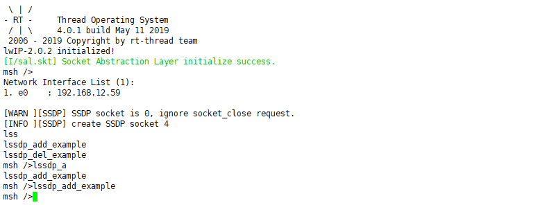
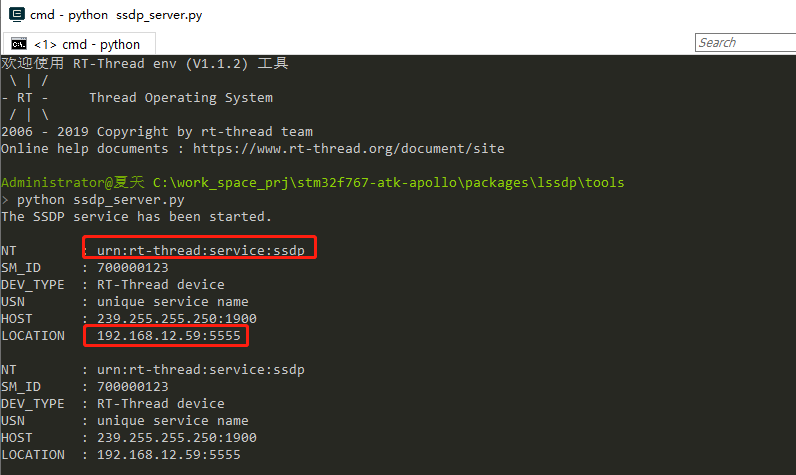

# LSSDP

## 1. 介绍 

LSSDP (Lightweight Simple Sever Discovery Protocol)，简单服务发现协议是一种应用层协议，此协议为网络客户提供一种无需任何配置、管理和维护网络设备服务的机制，此协议采用基于通知和发现路由的多播发现方式实现。

通过使用该软件包，可以让连接到局域网中的 RT-Thread 设备被客户端自动发现，并使用 RT-Thread 设备所提供的服务。例如 adb 软件包提供的文件传输服务。

### 1.1 许可证

The MIT License (MIT)

## 2. 获取软件包

在使用的 BSP 目录下，使用 ENV 工具打开 menuconfig 来获取软件包。

- 配置软件包并使能示例

```c
RT-Thread online packages --->
     IoT - internet of things  --->
         Lssdp: SSDP protocol implemented on rt-thread
             [*]   Enable LSSDP add/del samples
                   Version (latest)  --->
```

- 使用 `pkgs --update` 命令下载软件包

## 3. 使用 LSSDP

### 3.1 打开软件包示例

配置软件包时打开 lssdp 软件包的添加 `[*]   Enable LSSDP add/del samples` 选项，重新编译下载运行。

lssdp_add_example 命令会注册一个名为 `urn:rt-thread:service:ssdp` 的服务到 ssdp 中：



从示例代码中可以看到注册的设备信息：


## 3.2 运行桌面端测试程序

通过 tools 目录下的测试程序，可以看到在局域网中提供 `urn:rt-thread:service:ssdp` 服务的设备，如下图所示：



从上图可以看到从 RT-Thread 设备收到了提供  `urn:rt-thread:service:ssdp` 服务的设备信息。从 LOCATION 属性可以得知提供该服务的设备地址和端口号。

## 3.3 添加 lssdp 服务

可以参考 lssdp_sample 中的示例代码，使用如下 API 在 lssdp 中添加或者删除服务。

| API 接口                                        | 功能                |
| ----------------------------------------------- | ------------------- |
| int lssdp_service_add(struct lssdp_service *h); | 添加服务到 lssdp    |
| int lssdp_service_del(struct lssdp_service *h); | 从 lssdp 中删除服务 |

## 4、参考资料

- 无

## 5、 联系方式 & 感谢

- 维护： RT-Thread 开发团队
- 主页： https://github.com/RT-Thread-packages/lssdp
